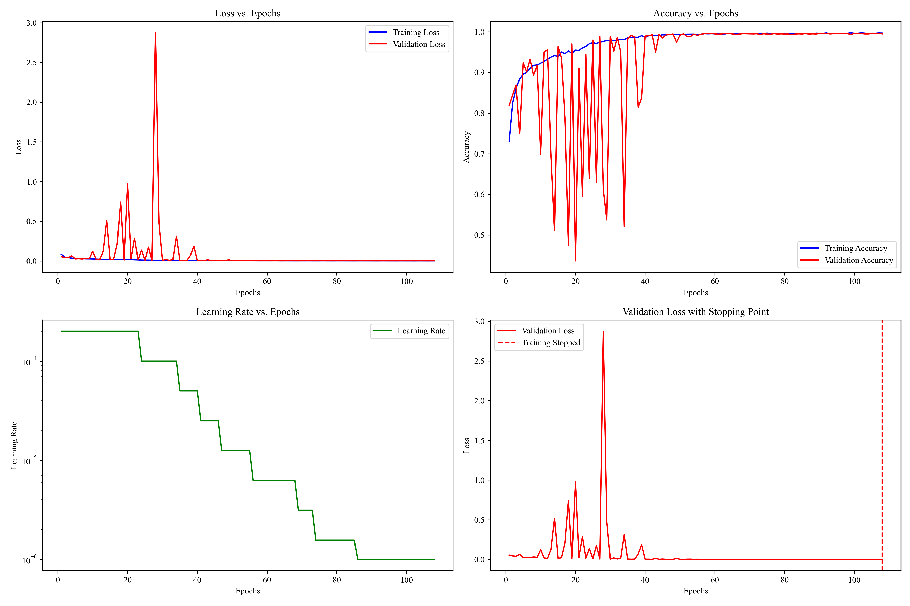
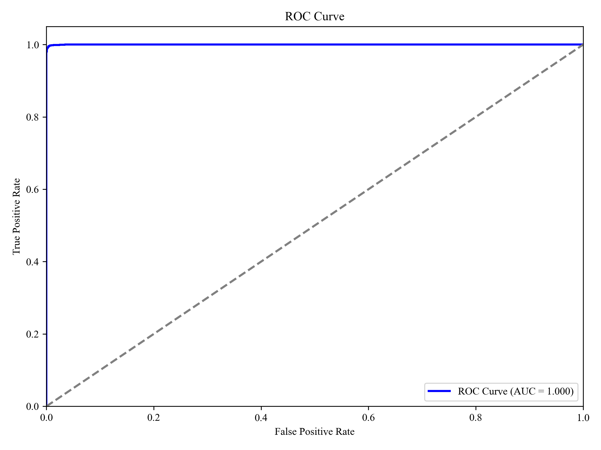
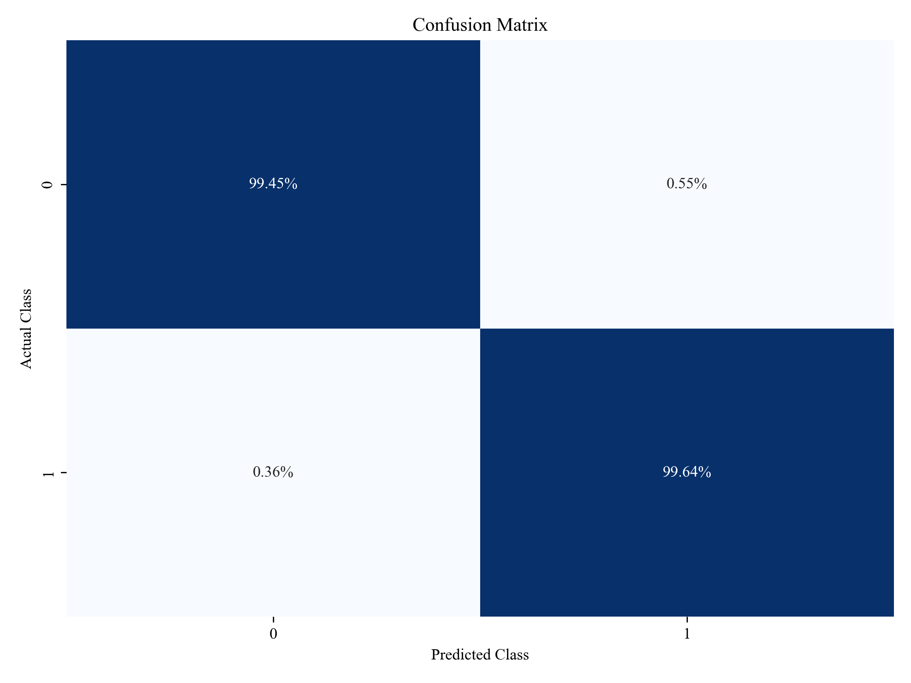

# Meteor_detection
- 一个基于深度学习的流星轨迹识别,在风光摄影场景下,筛选出大量星空照片中含有流星轨迹的部分
# 使用方法
- 在`./Camera_jpg_data`下存放需要筛选的图像(jpg格式),直接运行`./Detection.py`即开始处理,结果输出于`./result`
- 由于Github无法上传较大文件,故模型参数已被拆分为多个小文件,位于`./model_parts`下,首次使用,需要运行`./merge_model.py`以合并为需要的参数文件,届时将出现`./model.pth,由./Detection.py`自动加载

# 运行逻辑
- `Camera_jpg_data`将首先通过图像预处理pipeline,包括图像增强与阈值分割(由`image_processing_pipeline.py`定义),随后由模型筛选

# 模型训练
Train_val__test_meteor_detection_cnn.py
- 原始数据集正负样本极端不平衡,采用多种方法扩大数据集(翻转,旋转...),平衡样本比重(SMOTE对较少的正类样本超采样,`SMOTE_oversampling.py`)
- 考虑到实际场景需求,在训练中强化了对正类样本的权重
- 为提高流星检测的召回率，采用低决策阈值：`prediction_threshold=0.3` 而非常规的`0.5`，优先保证正类样本的识别
- 混合精度训练
- 早停机制 ：`early_stopping_patience=10` , `early_stopping_delta=0.001`

# 不足
- 模型有轻微的过拟合现象
- 训练集不够多样化

# 训练性能

<table style="width:100%; border-collapse: collapse;">
  <tr>
    <td style="text-align: center; padding: 5px; border: none;">
      
    </td>
    <td style="text-align: center; padding: 5px; border: none;">
      
    </td>
  </tr>
</table>
