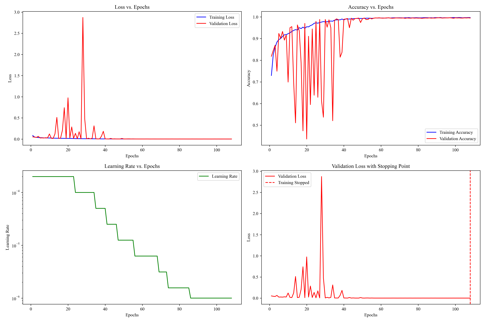
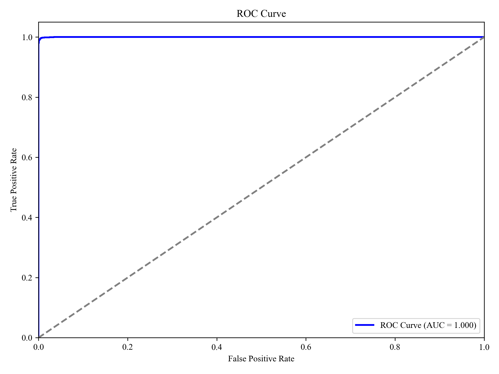
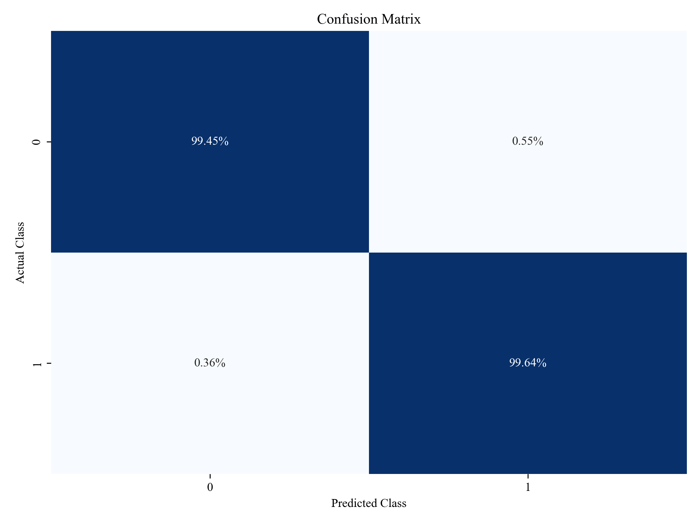

# Meteor_detection_v2
- 一个基于深度学习的流星轨迹识别,在风光摄影场景下,筛选出大量星空照片中含有流星轨迹的部分
# 使用方法
- 在`./Camera_jpg_data`下存放需要筛选的图像(jpg格式),直接运行`./Detection.py`即开始处理,结果输出于`./result`
- 由于Github无法上传较大文件,故模型参数已被拆分为多个小文件,位于`./model_parts`下,首次使用,需要运行`./merge_model.py`以合并为`Detection.py`需要的参数文件,届时将出现`./model.pth`

# 运行逻辑
- `Camera_jpg_data`将首先通过图像预处理pipeline,包括图像增强与阈值分割(由`image_processing_pipeline.py`定义),随后由模型筛选.
  
  <table style="width:100%; border-collapse: collapse;">
  <tr>
    <td style="text-align: center; padding: 5px; border: none;">
      
    </td>
    <td style="text-align: center; padding: 5px; border: none;">
      
    </td>
  </tr>
</table>

# 模型训练
`Train_val__test_meteor_detection_cnn_v2.py`
- 原始数据集正负样本极端不平衡,采用多种方法扩大数据集(翻转,旋转...),平衡样本比重(SMOTE对较少的正类样本超采样,`SMOTE_oversampling.py`)
- 考虑到实际场景需求,在训练中强化了对正类样本的权重
- 为提高流星检测的召回率，采用低决策阈值：`prediction_threshold=0.3` 而非常规的`0.5`，优先保证正类样本的识别
- 混合精度训练
- 早停机制 ：`early_stopping_patience=10` , `early_stopping_delta=0.001`

# V1的不足
- 原始的`OptimizedMeteorCNN`模型采用传统架构，主要存在以下局限性：

- 缺乏方向感知：传统卷积核各向同性，对所有方向特征的提取能力均等，未针对线状流星轨迹的优化

- 特征丢失：池化操作（如MaxPool2d）会损失空间分辨率，可能导致细长的流星轨迹特征被弱化或丢失

- 通用特征提取：模型设计没有针对流星轨迹的"线性"、"方向性"等特定视觉特征进行优化

# V2更新
## 方向感知卷积层
- 在原网络的第二阶段添加了4个方向的类`Gabor`滤波器（0°、45°、90°、135°），专门用于捕获不同角度的线性流星轨迹特征：

```python
# 方向感知卷积层定义
self.directional_conv0 = nn.Conv2d(64, 16, kernel_size=7, stride=1, padding=3)
self.directional_conv45 = nn.Conv2d(64, 16, kernel_size=7, stride=1, padding=3)
self.directional_conv90 = nn.Conv2d(64, 16, kernel_size=7, stride=1, padding=3)
self.directional_conv135 = nn.Conv2d(64, 16, kernel_size=7, stride=1, padding=3)

# 类Gabor滤波器初始化
self._init_directional_kernels()
```

## 方向卷积核的设计与初始化
- 使用预定义的类Gabor滤波器初始化方向卷积核，滤波器在提取边缘和线性特征
```python
def _init_directional_kernels(self):
    """Initialize directional convolution kernels with Gabor-like filters"""
    kernel_size = 7
    sigma = 1.5
    
    # Create grid for kernel
    x, y = np.meshgrid(np.arange(-3, 4), np.arange(-3, 4))
    
    # 0° direction
    kernel_0 = np.exp(-(x**2 + y**2) / (2 * sigma**2)) * np.cos(2 * np.pi * x / 3)
    # 45° direction
    kernel_45 = np.exp(-(x**2 + y**2) / (2 * sigma**2)) * np.cos(2 * np.pi * (x + y) / (3 * np.sqrt(2)))
    # 90° direction
    kernel_90 = np.exp(-(x**2 + y**2) / (2 * sigma**2)) * np.cos(2 * np.pi * y / 3)
    # 135° direction
    kernel_135 = np.exp(-(x**2 + y**2) / (2 * sigma**2)) * np.cos(2 * np.pi * (y - x) / (3 * np.sqrt(2)))
    
    # Initialize convolution kernels
    with torch.no_grad():
        self.directional_conv0.weight.copy_(torch.tensor(np.repeat(kernel_0, 16, axis=0), dtype=torch.float32))
        self.directional_conv45.weight.copy_(torch.tensor(np.repeat(kernel_45, 16, axis=0), dtype=torch.float32))
        self.directional_conv90.weight.copy_(torch.tensor(np.repeat(kernel_90, 16, axis=0), dtype=torch.float32))
        self.directional_conv135.weight.copy_(torch.tensor(np.repeat(kernel_135, 16, axis=0), dtype=torch.float32))
```
### 方向特征融合
- 将四个方向的特征图进行拼接融合，形成更丰富的方向信息表示

```python
# Apply directional convolutions
x0 = self.directional_conv0(x)
x45 = self.directional_conv45(x)
x90 = self.directional_conv90(x)
x135 = self.directional_conv135(x)

# Concatenate features from all directions
x = torch.cat([x0, x45, x90, x135], dim=1)
x = self.directional_bn(x)
x = self.directional_relu(x)

```

# Supplement

<table style="width:100%; border-collapse: collapse;">
  <tr>
    <td style="text-align: center; padding: 5px; border: none;">
      
    </td>
    <td style="text-align: center; padding: 5px; border: none;">
      
    </td>
  </tr>
</table>
